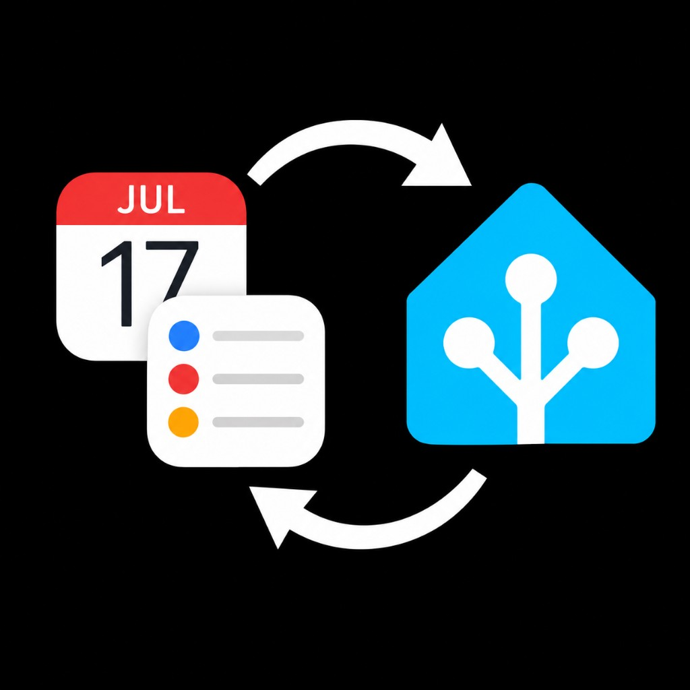

# Install & update guide

Apple HA Sync has two parts: a **Mac agent** (EventKit master) and a **Home Assistant** custom integration. Install both, then pair them.



## 1. Install the Mac agent

On the Mac that should own Calendar and Reminders:

```bash
git clone https://github.com/iHadAThought/AppleHAsync.git ~/appleHAsync
```

If Home Assistant runs on another machine and must reach the agent over LAN:

```bash
LISTEN_HOST=0.0.0.0 ~/appleHAsync/deploy/install-mac-agent.sh
```

Loopback-only (local testing):

```bash
~/appleHAsync/deploy/install-mac-agent.sh
```

What you get:

| Piece | Location |
|-------|----------|
| Code + venv | `~/appleHAsync` |
| App identity | `~/Applications/appleHAsync.app` |
| LaunchAgent | `app.iHadAThought.appleHAsync` |
| Config / secrets | `~/Library/Application Support/appleHAsync/` |
| Settings UI | `https://127.0.0.1:8745/ui/` |

Grant **Calendars** and **Reminders** Full Access to **appleHAsync** when macOS prompts you.

Useful overrides: `REPO_URL`, `INSTALL_DIR`, `LISTEN_HOST`, `LISTEN_PORT`.

### Settings UI (first run)

1. **Setup** — request permissions; copy agent token for HA
2. **Shares** — enable calendars / reminder lists; choose which details sync per source
3. **Home Assistant** — enter HA URL + long-lived token → Test connection → Save
4. After HA pairing, add webhook id/secret from `apple_hasync.get_pairing_info`

## 2. Install the Home Assistant integration

### HACS (recommended)

1. HACS → Integrations → Custom repositories
2. URL: `https://github.com/iHadAThought/AppleHAsync` · Category: **Integration**
3. Download **Apple HA Sync** → restart Home Assistant
4. Settings → Devices & services → Add **Apple HA Sync**
5. Agent base URL (example `https://192.168.1.50:8745`) + agent bearer token
6. For lab self-signed TLS, disable Verify TLS or install the agent CA; for plain HTTP lab, enable Allow insecure HTTP on both sides

Minimum Home Assistant: **2025.12** (`hacs.json`).

### Manual copy

```bash
# From a checkout of this repo:
cp -R custom_components/apple_hasync /path/to/ha/config/custom_components/
```

Or package a tarball:

```bash
./deploy/install-ha-component.sh   # writes /tmp/apple_hasync_cc.tgz
```

Restart Home Assistant, then Add integration as above.

## 3. Pair webhooks

1. In HA Developer Tools → Actions, call `apple_hasync.get_pairing_info`
2. On the Mac, open the settings UI **Home Assistant** tab (or CLI `ha add` / `ha update`) and set webhook id + secret
3. Optional helper: `HA_URL=http://homeassistant.local:8123 ./deploy/finish-ha-pairing.sh`

## 4. Update

### Mac agent

```bash
~/appleHAsync/deploy/update-mac-agent.sh
# After iCloud share-ID churn:
~/appleHAsync/deploy/update-mac-agent.sh --repair-shares
```

Config, secrets, and shares are preserved. If you previously used bundle id `app.ghostnetwork.appleHAsync`, the updater removes the old LaunchAgent — re-approve Calendar/Reminders for **appleHAsync** if entities go unavailable.

### Home Assistant

- **HACS:** update Apple HA Sync from HACS, then restart (or reload) Home Assistant
- **Manual:** replace `custom_components/apple_hasync` and restart

## 5. Uninstall

```bash
~/appleHAsync/deploy/uninstall-mac-agent.sh
PURGE=1 ~/appleHAsync/deploy/uninstall-mac-agent.sh --force
```

Then in HA: Settings → Devices & services → Apple HA Sync → Delete. Remove the custom component folder (or HACS remove) if desired.

## Troubleshooting

| Symptom | What to check |
|---------|----------------|
| Gear icon → config flow 500 | Update to integration ≥ 0.1.3 (OptionsFlow fix for HA 2025.12+) |
| Entities unavailable | Mac shares enabled? TCC Full Access for appleHAsync? Agent reachable? |
| SSL wrong version number | HA using HTTPS against an HTTP agent (or vice versa) |
| Stale calendars after iCloud | `update-mac-agent.sh --repair-shares` then Configure/Reload in HA |
| Agent not reachable from HA | `LISTEN_HOST=0.0.0.0`, firewall, and optional IP allowlist |

Logs (Mac): `~/appleHAsync/logs/agent.out.log` and `agent.err.log`.

## Security notes

- Prefer HTTPS + verify TLS in production
- Do not expose the agent without a strong token; use `allowed_source_ips` when binding non-loopback
- Webhook HMAC is required — empty secrets are rejected
- Loopback `/v1/setup/bootstrap` returns the agent token only on `127.0.0.1` / `::1`
